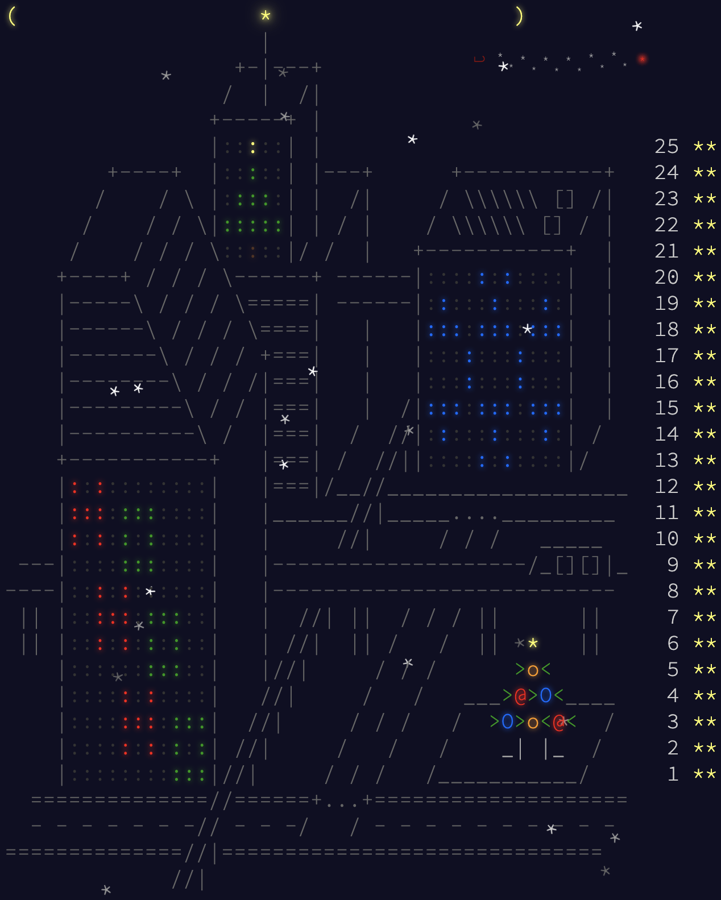

# AdventOfCode2016 :camel:
Solutions to all 25 AoC 2016 problems in OCaml!

This was my first time ever writing or seeing OCaml. I figured it was a nice choice to try and practice more functional programming. Some things about the language I thought were really nice, like the fact that it's not completely pure which is [nice some times](./src/day08.ml), and FP things like advanced pattern matching were really nice. However, it's strange to me that the default hashmap and queue implementations are not pure. The fact that the language is strongly typed, while I never had to write a single type declaration myself, is really nice.

One thing I really disliked was the lack of generic code. Instead of something like `list |> map (..) |> filter (..)`, you always have to write `list |> List.map (..) |> List.filter (..)` or `list |> List.to_seq |> Seq.map (..) |> Seq.filter (..)`. If all containers implemented an iterator trait (like in [Rust](https://doc.rust-lang.org/std/iter/trait.Iterator.html)) then the language would be so much less verbose. Additionally, not all container implement the same iterator functions. List has `filter` but String doesn't for example, which would also be solved by an shared trait. This means you have to convert back and forth between data structures all the time. They have a shared type `Seq` used to convert between stdlib's data structures, however it is severely lacking in functions. To filter a string you need to do something ridiculous and inefficient like:

```ocaml
s
|> String.to_seq
|> Seq.filter (fun c -> ..)
|> Seq.map (String.make 1)
|> List.of_seq
|> String.concat ""
```

Additionally, some things seemed needlessly complex. Like using sets, you need to instantiate a new set of your type but not only that. You have to define a new struct with an associated type and a compare function. Most people recommend just using hashtable of `t -> bool` instead, unless you need the set specific functions. I'm sure there are good reasons for it but as a beginner who just wants to use a set it felt ridiculous.

Lastly, the syntax and error messages are really bad. If you miss an `in` you get a syntax error several lines down for example. And top-level expressions really confused me for a while.

Overall, I thought OCaml was an ok language. FP is really powerful and expressive but compared to something like Clojure or Haskell I see no reason why I would ever use it again.

## Usage
```
dune exec --release src/DAY.exe
```


