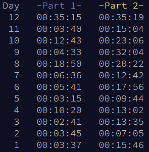

# AdventOfCode2025 :christmas_tree:
Solutions to AoC 2025 in Rust :crab:

I found this year one of the easiest so far.
Not sure if it's just that I've done this 10 times
now, if its because it was only 12 days, or if it
was genuinely easier.

Missing the global leaderboard was a bit sad I think.
I get why he removed it but I feel like we lost
a bit of the community around it.

Total runtime is around `500ms`.

## Leaderboard

